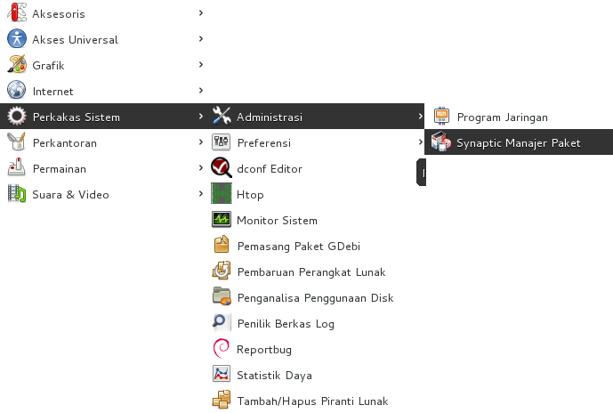
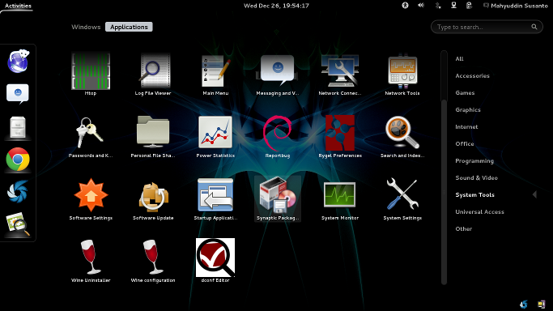
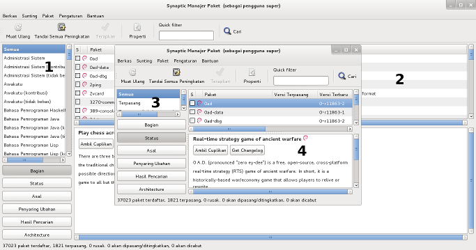
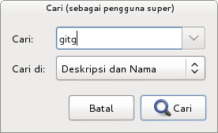
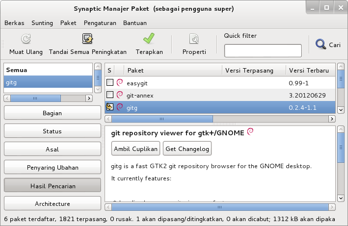
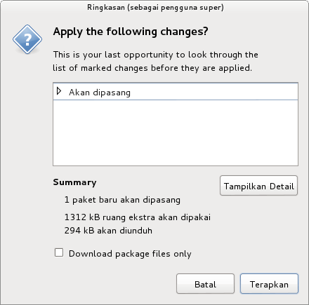
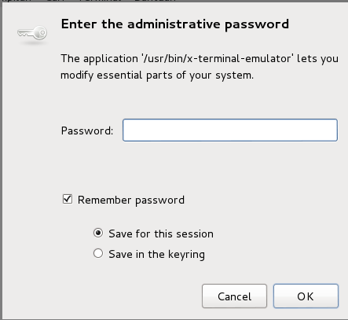
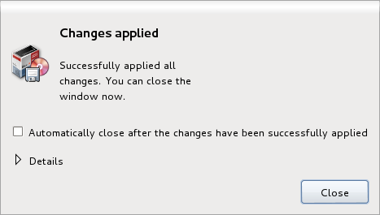

Synaptic - Pemasangan perangkat lunak dengan GUI
================================================

Selain menggunakan apt, dpkg, dselct, kita juga dapat menggunakan antarmuka
grafis dengan synaptic. Untuk mengakses synaptic package manajer dapat dengan
mengetikkan synaptic bila menggunakan gnome-shell atau dengan memilih **Aplikasi>
Perkakas System > Administrasi> Synaptic Package Manajer** bila menggunakan
gnome-clasic.

    
    Tampilan layar bila menjalankan synaptic menggunakan gnome-classic

    
    Tampilan layar bila menjalankan synaptic menggunakan gnome-shell

Untuk desain synaptic dan penjelasanya dapat dijelaskan dari gambar dibawah 
ini

    Tampilan desain synaptic package manager

#. Daftar perangkat lunak.
#. Paket perangkat lunak untuk setiap kategori.
#. Status perangkat lunak/paket yang terpasang, belum terpasang, rusak dan 
   lain-lain.
#. Informasi lanjut dari paket yang terpilih.

Untuk mencari nama paket atau deskripsi paket dapat menggunakan fasilitas
pancarian, fasilitas pencarian dapat diluncurkan dengan menekan **CTRL + F**.
Misalnya seperti pada gambar dibawah ini.

    Fasilitas Pencarian

Pemasangan paket
-------------------------------

Untuk melakukan pemasangan paket, klik kanan dan pilih **Tandai untuk
dipasang** atau klik dua kali pada daftar paket.

    Pilih paket yang akan dipasang

Setelah itu, klik **Apply** dan akan ada jendela konfirmasi ikhtisar dari 
paket yang akan dipasang.

    Jendela konfirmasi paket yang akan dipasang

.. note::
    
    Anda dapat menggunakan CTRL+P untuk melakukan apply

Setelah itu masukkan kata sandi root dan tekan enter.

    Jendela yang mewajibkan kita untuk memasukkan kata sandi.

Silakan tunggu pada saat proses pemasangan, durasi pemasangan ini tergantung
pada kekuatan sistem pada saat memproses. Proses akan selesai bila kita
menjumpai tampilan layar sebagai berikut.

    Jendela konfirmasi penyelesaian proses pemasangan

Pencopotan paket
----------------

Untuk melakukan pengucangan/pencopotan paket, silakan klik kanan paket dan 
pilih **Mark for Removal** dari menu. Kemudian klik **Apply**, kemudian 
tampilan layar akan seperti pemasangan.

Pemutakhiran paket
------------------

Untuk melakukan pemutakhiran (**upgrade**) paket, silakan pilih paket dan
klik kanan, kemudian pilih **Mark for Upgrade** atau tekan **CTRL+U** dan
tekan **Apply**.

