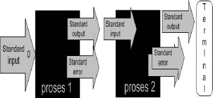
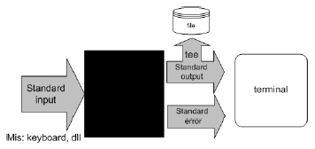
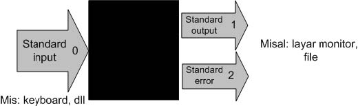
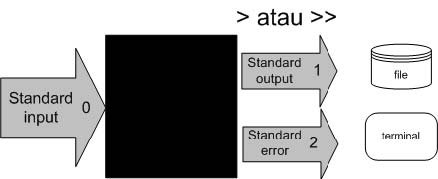
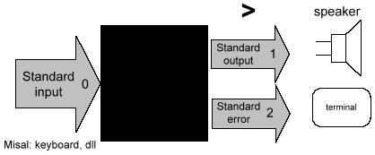
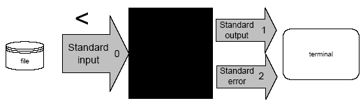
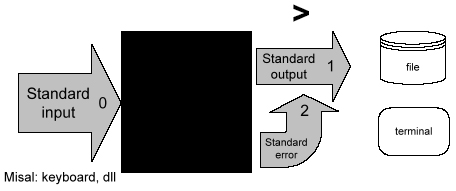

==============
Stream dan Sed
==============

Piping dengan Notasi "|"
========================

'Piping' merupakan utility GNU/Linux yang dapat digunakan untuk mengarahkan sebuah output perintah menjadi masukan bagi perintah yang lain.

   *Konsep piping*

**Contoh 1:**

::

   ~# cat databaru >> dataku | more dataku
   ::::::::::::::
   dataku
   ::::::::::::::
   Saat ini kami sedang belajar
   penggunaan redirection untuk standard input
   sehingga inputan bukan dari standard output
   seperti keyboard melainkan dari file text
   ASSalamu alaikum Wr. Wb.
   Hello....
   Saat ini Saya Sedang belajar
   command line Unix/GNU/Linux
   haruS berSabar memang untuk
   mempelajarinya. Ehehehe....

Pada contoh di atas, output perintah ``cat`` akan menjadi masukan bagi perintah ``more``.

**Contoh 2:**

Penulis ingin mencari kata 'elektronik' pada sebuah file text 'bertanya yang baik.txt'. Secara logika kita dapat mencarinya secara manual dengan membuka file text tersebut terdahulu. Tapi jika jumlah kalimat pada file sangat banyak, maka pasti kita akan kerepotan sendiri mencarinya. Dengan bantuan 'piping' yang digabungkan dengan perintah ``grep``, pencarian kata tersebut akan sangat mudah.

::

   ~# cat bertanya\ yang\ baik.txt | grep elektronik | more

Output program di atas::

   Tidak ada yang tahu jawabannya bukan berarti Anda diabaikan, walaupun memang 
   sulit untuk membedakannya (karena sifat komunikasi elektronik yang faceless).

Selain menampilkannya ke layar komputer, anda juga dapat mengarahkan hasil pencarian tersebut ke file text lain dengan menggunakan redirection ">".

::

   ~# cat bertanya\ yang\ baik.txt | grep elektronik > elektronik.txt
   ~# more elektronik.txt

Output program di atas::

   Tidak ada yang tahu jawabannya bukan berarti Anda diabaikan, walaupun memang 
   sulit untuk membedakannya (karena sifat komunikasi elektronik yang faceless)

**Contoh 3:**

::

   $ tr 'A-Z' 'a-z' < bertanya\ yang\ baik.txt | tr –cs 'a-z' '\n' | sort | 
   uniq > bertanya.txt

Pada contoh di atas, dapatkah anda membayangkan output dari perintah tersebut. Jika melihat perintah tersebut mungkin pembaca pemula akan sedikit pusing melihatnya, namun cukup sederhana. Mari kita lihat secara terpisah dari penggabungan beberapa perintah:

**tr 'A-Z' 'a-z' < bertanya\\ yang\\ baik.txt** – akan mengganti semua huruf kapital menjadi huruf kecil pada file text 'bertanya yang baik.text'.

**tr -cs 'a-z' '\\n'** – akan memenggal setiap kata ke baris baru

**sort** – akan mengurutkan kata-kata tersebut sesuai abjad (a-z)

**uniq** – akan menghilangkan salah satu kata yang sama

sehingga output dari perintah di atas adalah::

   ada
   adalah
   agar
   ah
   akan
   akunting
   alasan
   alih
   am
   amburadul
   ampun
   anda
   aneh
   anggota
   apa
   apakah
   arsip
   asal
   ask
   asumsikan
   at
   atau
   ayang
   baca
   bagaimana
   bagi
   bahasa
   bahkan
   bahwa
   baik
   balasan
   balasannya
   balik
   bantuan
   banyak
   bayar
   bayaran
   beberapa
   begini
   beginian
   bekerja
   bekerjasama
   belum
   .
   .
   .
   dst.
   .
   .
   .
   webmaster
   website
   www
   x
   xt
   xxx
   ya
   yang

**tee** – Membaca informasi dari standar input kemudian menuliskannya ke standar output. Perintah ``tee`` ini biasanya digunakan di tengah-tengah pipeline.

   *Konsep tee*

Misal::

   $ ps aux | tee data.txt | more
   USER  PID   %CPU  %MEM  VSZ   RSS   TTY   STAT  START  TIME  COMMAND
   root  1     0.0   0.2   1492  460   ?     S     11:02  0:00  init [2]
   root  2     0.0   0.0   0     0     ?     S     11:02  0:00  [keventd]
   root  3     0.0   0.0   0     0     ?     SN    11:02  0:00  [ksoftirqd_CPU0]
   root  4     0.0   0.0   0     0     ?     S     11:02  0:00  [kswapd]
   root  5     0.0   0.0   0     0     ?     S     11:02  0:00  [bdflush]
   root  6     0.0   0.0   0     0     ?     S     11:02  0:00  --More--

Pada contoh di atas, output perintah ``ps aux`` selain di simpan ke dalam file text 'data.txt' juga akan ditampilkan ke layar komputer oleh perintah ``more``.

Quote
=====

Terkadang command line Unix/GNU/Linux dapat membuat kita putus asa dan menyebalkan. Sebagai contoh penggunaan karakter-karakter aneh seperti $, \*, &, \\, \?. Namun, jika telah terbiasa maka penggunaan karakter-karakter tersebut bukan merupakan sesuatu yang sangat mengerikan. Bahkan penggunaannya dapat mempermudah melakukan aktivitas pada mode teks.

Pada *bash shell*, karakter \* dan \? merupakan wildcard dan $ berarti variabel. Pada sub bab ini penulis mencoba menjelaskan qoute ('', \*, \\, \\\\) yang dapat digunakan untuk mempermudah saat bekerja di lingkungan mode teks GNU/Linux.

**Contoh 1:**

::

   $ cat 'data baru aku.txt'
   kari  1018 0.0 0.3 1772  616 pts/1 T  13:00 0:00 more
   kari  1020 0.0 0.3 1772  632 pts/1 T  13:00 0:00 more data.txt
   kari  1023 0.0 0.3 1772  620 pts/1 T  13:01 0:00 more
   kari  1026 0.0 0.3 1772  616 pts/1 T  13:01 0:00 more
   kari  1029 0.0 0.3 1772  620 pts/1 T  13:02 0:00 more
   kari  1033 0.0 0.5 2480  840 pts/1 R+ 13:02 0:00 ps aux
   kari  1034 0.0 0.2 1484  396 pts/1 R+ 13:02 0:00 tee data.txt
   kari  1035 0.0 0.9 2544 1460 pts/1 R+ 13:02 0:00 /bin/bash

Lihat betapa pentingnya penggunaan qoute ini. Jika tidak menggunakan quote (''), perintah ``cat`` akan mencoba menampilkan tiga file yang berbeda yakni: data.txt, baru.txt, aku.txt.

**Contoh 2:**

::

   $ rm –rf 'data*.txt'

akan menghasilkan hasil berbeda dengan perintah berikut::

   ~$ rm –rf data*.txt

Pada contoh kedua di atas, file text yang cocok dengan \*data\*\* seperti data.txt, dataku.txt, databaruku.txt, dll akan terhapus.

Proses Input dan Output
=======================

Hubungan antara sebuah program dan sumber informasinya dan kontrol disebut dengan standar input. Jika bukan sebuah program, maka standar input defaultnya adalah keyboard. Secara default, standar output dan error biasanya menuju ke terminal atau layar komputer.

Jika sebuah program atau perintah tereksekusi dengan benar, maka hasil dari eksekusinya akan ditampilkan ke terminal (standar output 1) jika tidak dilakukan penginisialisasian standar output. Sebaliknya, jika eksekusi program gagal, maka akan menuju ke standar error 2 (default: terrminal).

   *Proses input output*

Sebagai contoh, jika terdapat sebuah file dengan nama data.txt yang berisi 5 buah nama yang tidak tersusun secara berurut, maka untuk menampilkan isi file tersebut secara berurut dapat menggunakan perintah ``sort``.

::

   $ sort data.txt

.. Note::

   data.txt merupakan masukan (input) bagi perintah ``sort`` sedangkan outputnya
   menuju ke terminal komputer.

Output Redirection
==================

Pada sistem GNU/Linux, keluaran (output) dari sebuah perintah secara default akan menuju ke terminal. Namun, keluaran sebuah perintah dapat dialihkan ke sebuah file dan proses ini disebut output redirection.

Output redirection dinotasikan dengan '>' atau '>>' seperti yang tampak pada gambar berikut.

   *Redirection standard output*

Output redirection ini banyak digunakan untuk:

-  Menyalin hasil/error ke sebuah file untuk disimpan secara permanen.
-  Menyalin hasil/error ke printer untuk mendapatkan sebuah dokumentasi dalam bentuk hardcopy.
-  Mengkombinasikan dua buah perintah sehingga dapat digunakan secara bersamaan.

Karakter yang digunakan oleh operator output redirection:

**Karakter operator output redirection:**

+---------------+-------------------------------------------------------------------+
|  Karakter     |          Fungsi                                                   |
+===============+===================================================================+
|      >        | Mengirimkan output (redirection) ke sebuah file atau perangkat    |
|               | output yang lain (misal: printer, display monitor, dll).          |
|               | Jika file tersebut sudah ada, maka secara otomatis akan ditimpah. |
+---------------+-------------------------------------------------------------------+
|     >>        | Fungsinya sama Redirection ini memiliki fungsi yang sama dengan   |
|               | redirection pertama. Namun redirection tidak akan menimpah file   |
|               | yang telah ada sebelumnya.                                        |
+---------------+-------------------------------------------------------------------+

Penggunaan Karakter ">"
-----------------------

Anda ingin menyalin sebuah string ke sebuah file (data.txt) dengan kata kunci 'ltmodem' yang terdapat pada sebuah file ``ltmodem.abw``. Perintah yang digunakan adalah::

   $ grep 'ltmodem' /home/kari/ltmodem.abw > data.txt
   $ more data.txt

Contoh lain:

Perintah ``ls –alF`` akan menampilkan seluruh file atau direktori di mana anda bekerja saat ini.

::

   $ ls –alF > data.txt

Perintah di atas akan menampilkan output dari perintah ``ls -alF`` pada file data.txt
Selain *output redirection* '>' mengarahkan keluarannya ke *output* standar berupa *file* atau terminal. *Output redirection* ini juga dapat digunakan untuk mengarahkan output ke perangkat/device.

   *Standar output menuju speaker*

Misal::

   $ cat sound.wav > /dev/audio

Perintah di atas akan menghasilkan suara 'sound.wav' pada *speaker* anda. Perintah tersebut sering digunakan untuk memeriksa apakah *soundcard* komputer telah berjalan dengan baik.

Penggunaan Karakter ">>"
------------------------

Sedangkan penggunaan karakter ">>" dapat anda perhatikan perbedaan dari *output* yang dihasilkan.

::

   $ grep 'ltmodem' /home/kari/ltmodem.abw >> data.txt
   $ more data.txt

.. Note::

   Pada contoh di atas terlihat bahwa *output* dari perintah sebelumnya akan 
   ditambahkan pada bagian akhir dari kalimat tersebut (terulang 2x).

Input redirection
=================

*Input redirection* adalah masukan perintah dapat diarahkan dari sebuah file dan dinotasikan dengan '<'.

   *Input redirection dari sebuah file*

Penggunaan Karakter "<"
-----------------------

Secara *default* standar input membaca informasi masukan dari keyboard, tapi sebenarnya standar input juga dapat menerima masukan dari file text biasa.

Misal::

   $ cat < dataku
   Saat ini kami sedang belajar
   penggunaan redirection untuk standar input
   sehingga masukan bukan dari standar input
   seperti keyboard melainkan dari file text

Pada contoh di atas perintah 'cat' akan membaca informasi masukan dari sebuah *file* yakni "dataku" dan menampilkannya ke layar komputer.

*Input/output redirection* '<', '>' atau '>>' dapat digabungkan penggunaannya satu dengan yang lain.

Misal::

   $ cat <dataku>> databaru
   $ more databaru
   ASSalamu alaikum Wr. Wb.
   Hello....
   Saat ini Saya Sedang belajar
   command line Unix/GNU/Linux
   haruS berSabar memang untuk
   mempelajarinya. ehehehe....
   Saat ini kami sedang belajar
   penggunaan redirection untuk standar input
   sehingga masukan bukan dari standar input
   seperti keyboard melainkan dari file text

Perintah di atas akan membaca informasi masukan dari *file* "dataku" kemudian *output* akan diarahkan ke *file* "databaru". Karena "databaru" telah terdapat sebuah teks, maka penulis menggunakan *redirection* '>>' agar teks sebelumnya tidak tertimpa oleh teks baru.

Standar kesalahan (error) menuju sebuah file
============================================

Secara *default* standar *error* biasanya diarahkan ke terminal komputer. Namun, pengguna juga dapat mengarahkannya ke sebuah *file*. Untuk *bash shell* yang umum digunakan pada GNU/linux menggunakan notasi **2>&1**.

   *Standar error ke sebuah file*

Misal::

   $ ls –l askari > output 2>&1

Sed – stream editor
===================

``Sed`` merupakan *utility* unix yang dapat digunakan untuk mengganti teks atau *string* dengan *string* atau teks lain pada sebuah *file*.

::

   $ cat <file> | sed –e 's/<text yang dicari>/<text pengganti>/<option>' > <fileakhir>

Misal::

   $ cat > data
   Assalamu Alaikum Wr. Wb.
   Hello....
   saat ini saya sedang belajar
   command line Unix/GNU/Linux
   harus bersabar memang
   untuk mempelajarinya. Ehehehe....

^C (tekan ctrl-C)

Selanjutnya huruf "s kecil" yang terdapat pada kalimat di atas akan diganti dengan huruf "S besar". Kemudian dengan menggunakan *redirection* yang telah dijelaskan sebelumnya, maka *file* perubahan akan disimpan dengan nama *file* baru yaitu "databaru".

::

   $ cat data | sed –e 's/s/S/g' > databaru
   $ more databaru
   ASSalamu alaikum Wr. Wb.
   Hello....
   Saat ini Saya Sedang belajar
   command line Unix/GNU/Linux
   haruS berSabar memang untuk
   mempelajarinya. Ehehehe....
